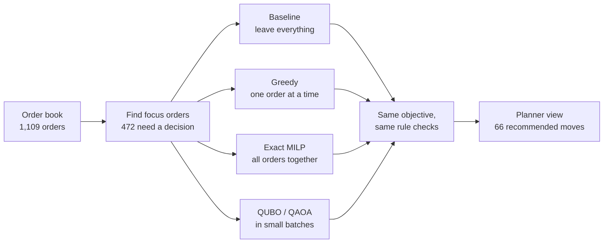
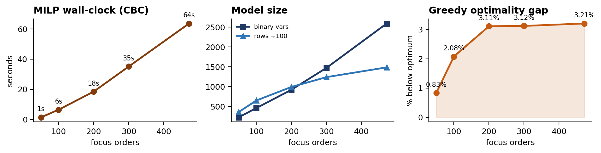
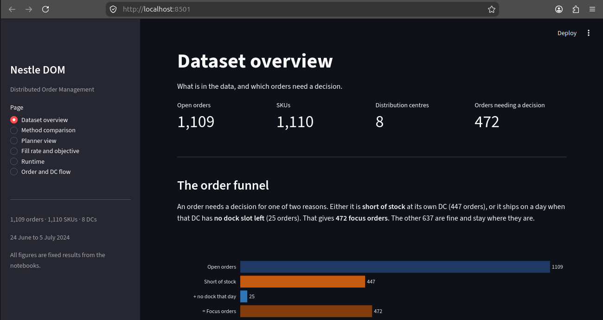

# Distributed Order Management with Classical and Quantum Optimization

**WISER Global Quantum+AI Program 2026 — Nestlé Challenge**
*Team Feynman Prodigies*

When a warehouse cannot fill an order, a planner has to choose: send a part delivery and lose the sale, or move the order to another warehouse and pay more to ship it. Do that for a whole order book at once and the choices stop being independent — warehouses share stock, docks and picking staff, so every move changes what is possible for the next order.

We solved that problem four ways on the same data, scored them with the same objective, and checked every answer with the same rule checker. **The exact solver is worth $1.93M more than doing nothing**, and it pays *less* extra freight than the cheap heuristic while moving more orders.

**We make no quantum advantage claim.** The goal was to find out where quantum optimization is competitive, where it only matches classical methods, and where the limits still are. On this data it matches.

---

## The problem in one line

```
Objective  =  Sales revenue  −  Penalty for unmet demand  −  Shipping cost
```

Maximise it, subject to seven business rules. On this data pack: **1,109 orders**, **1,110 SKUs**, **8 distribution centres**, and **472 orders that need a decision**.

---

## How the pipeline works



An order joins the focus list if it is **short of stock** at its own warehouse (447 orders), or if it ships on a day when that warehouse has **no dock slot left** (25 orders).

---

## Main result

Measured on all 472 focus orders.

| Method | Objective | Fill rate | Orders moved | Runtime |
|---|---|---|---|---|
| Leave everything alone | $44,365,994 | 90.47% | 0 | 0.21s |
| Greedy — by order value | $44,810,604 | 91.28% | 41 | 0.40s |
| Greedy — by shortage | $44,786,479 | 91.26% | 39 | 0.42s |
| **Exact MILP (PuLP + CBC)** | **$46,295,828** | **93.28%** | **66** | **63.72s** |

> [!IMPORTANT]
> **The exact solver moves 66 orders against the greedy's 41, and still pays $15,285 less in extra freight.**
>
> This is the clearest evidence that the orders really do depend on each other. Planning them together lets the solver pick cheaper lanes and chain moves: emptying one warehouse frees stock that lets a second order move in. A method that decides one order at a time and never goes back cannot see that.

**The greedy captures only 23% of the gain that is actually reachable.** Against the full objective its gap looks small (3.21%), but most of that money sits in orders that were never in trouble. Measured against the distance between doing nothing and the proven best answer, the greedy leaves three quarters behind.

---

## The greedy gets worse as the problem grows

We solved five sizes of the same problem to the proven best answer and measured how far the greedy fell behind each time.

| Focus orders | 50 | 100 | 200 | 300 | 472 |
|---|---|---|---|---|---|
| **Greedy gap** | 0.84% | 2.08% | 3.11% | 3.12% | **3.21%** |

On small problems a heuristic is nearly as good as the best answer. The more orders compete for the same stock, the more it loses by never going back. A full production order book would widen this further.

---

## What actually blocks a move

| Reason | Candidates rejected | Share |
|---|---|---|
| The 5% fill-rate gate | 1,682 | 46.0% |
| The other warehouse does not stock the SKU | 1,457 | 39.8% |
| No workable alternative at all | 423 | 11.6% |
| Everything else | 97 | 2.6% |

**Docks and picking together block 28 candidates out of 3,659.** The network is not short of buildings. It is limited by the move policy and by which warehouses carry which products — both of which are decisions, not physics.

---

## The quantum side

We built the QUBO/Ising version of the same model. Capacity becomes a penalty term in the objective, so the encoding needs **no slack qubits** — qubits equal orders × candidate warehouses exactly. A batch of 6 orders and 3 warehouses is **18 qubits**, against roughly 54 for the usual slack-based encoding.

**We checked it against ground truth first.** A 3×3 instance has only 27 valid combinations, so we listed all of them:

| | Objective |
|---|---|
| Leave everything alone | $721,191 |
| Every combination (true best) | **$760,518** |
| QUBO ground state | **$760,518** |
| QAOA, best of 5 runs | **$760,518** |

Ranking those 27 answers by QUBO energy gives the same order as ranking them by money, so the encoding is faithful and not merely lucky. Five QAOA runs gave a spread of **0.046%**, four hit the exact best, and all five beat doing nothing. No repair was needed.

Scaled to **15 batches covering 75 orders**, it raised the objective by **$1,358,671** (+10.0%) and fill rate from 88.6% to 97.3%, with **zero rule violations** and 1.07 seconds of solve time.

> [!NOTE]
> **The quantum solver matches the greedy exactly — the difference is $0 on every batch.**
>
> That is the honest headline. At 18 qubits a batch is small enough that both methods find the same best answer, so this shows the encoding is **correct**, not that quantum is **faster**. Everything that would have to be true before claiming a hardware advantage does hold: a faithful energy ordering, a ground state equal to the true best, stable repeated runs, no slack qubits, and batching that keeps the qubit count flat as orders grow. All runs used exact solvers and noise-free simulation.

---

## Scalability



### What grows on the classical side

Binary variables are **orders × candidate warehouses**. Constraint rows are dominated by the stock rows, which are **warehouse × SKU × day**. Every size below reached the proven best answer.

| Focus orders | Binary variables | Rows | Solve time |
|---|---|---|---|
| 50 | 227 | 35,830 | 1.4s |
| 100 | 458 | 64,976 | 6.4s |
| 200 | 920 | 99,153 | 18.5s |
| 300 | 1,472 | 123,972 | 35.1s |
| **472 (all)** | **2,594** | **148,663** | **63.7s** |

Doubling from 50 to 100 orders doubles the binaries and costs 4.6× the time. From 300 to 472 the binaries rise 1.8× and time rises 1.8×. Growth is steep but not explosive at this size, which is why **no subset was needed — the whole focus set solves in about a minute.**

### What grows on the quantum side

Qubits are **orders × candidate warehouses per batch**, with no slack variables. That choice is what keeps the numbers small:

| Orders in a batch | 3 | 6 | 9 | 12 | 18 |
|---|---|---|---|---|---|
| Qubits, no slack (ours) | 9 | **18** | 27 | 36 | 54 |
| Qubits with slack variables | 27 | 54 | 81 | 108 | 162 |

Exact ground-state solving costs 2ⁿ, so 18 qubits takes about 0.3 seconds and 27 would take roughly 500× longer. **18 qubits per batch is our ceiling**, and batching is what keeps us under it.

### The lever we tested

Batching is not proposed on paper — it is built and measured. The 90 highest-value orders split into **15 batches** of 3 to 6 orders, chosen so the orders in a batch share candidate warehouses. Batch size stays between 9 and 18 qubits no matter how many orders there are in total.

| | Classical MILP | Quantum, batched |
|---|---|---|
| Orders handled together | all 472 | 3–6 per batch |
| Sees links between orders | yes | only inside a batch |
| Time for the whole set | 63.7s | 1.07s |

The cost of batching shows up in the classical results. Solving 472 orders together produces 66 moves and *saves* freight, because the solver can chain moves across warehouses. Batches cannot chain across their own boundary, so that saving is exactly what batching gives up.

### What breaks first

Not the qubit count, and not the solve time. **It is the number of two-qubit gates.** Constraint terms grow quadratically with batch size: an 18-qubit batch already needs 63 quadratic terms against 18 linear ones. On real hardware that depth, not the width, is what current devices struggle with.

---

## The planner dashboard



Six pages that walk through the planner workflow: the data, the method comparison, the recommended moves, fill rate and cost, runtime, and a flow view of where orders go. Everything in it is fixed output from the notebooks, so it opens instantly and needs no data files.

---

## What is in this repo

| Folder | What is in it |
|---|---|
| `notebooks/` | 12 notebooks. **Each one runs on its own** — no notebook reads another's output |
| `src/` | The same logic as importable modules, plus the two quantum encodings |
| `dashboard/` | The Streamlit app and its fixed numbers |
| `Docs/` | Technical report, business summary, planner view |
| `deliverables/` | The four challenge tasks written up |
| `Presentation/` | The 7-slide deck |
| `Figures/` | Every chart, all generated from the notebooks |
| `tests/` | 17 checks on the data, the seven rules, and the objective |
| `scripts/` | Exact ground-state solver used by the quantum notebooks |

| Notebook | What it does |
|---|---|
| `01` – `02` | Explore the data, prepare it, and state the rules |
| `03` – `05` | Baseline, greedy heuristic, exact MILP |
| `06` – `10`, `12` | Quantum: validation, the encoding, batching, QAOA, hybrid |
| `11` | All results side by side — **no computing, results only** |

---

## How to run it

### The notebooks

You need the challenge data pack. Put the `DOM-data` folder anywhere inside the project — the notebooks find it by themselves. Nothing is uploaded from inside a notebook and nothing is saved to disk.

```bash
python3 -m venv .venv
source .venv/bin/activate          # Windows: .venv\Scripts\activate
pip install -r Requirement.txt

jupyter lab
```

Then open any notebook and run it top to bottom. They do not depend on each other, so you can start anywhere.

On Colab, upload the data folder to `/content` and press **Run all**. Notebook 05 installs PuLP by itself if it is missing.

### The dashboard

```bash
source .venv/bin/activate
cd dashboard
streamlit run app.py
```

It opens at `http://localhost:8501`. No data files needed.

### The tests

```bash
pip install pytest
cd tests
DOM_DATA="/path/to/DOM-data/input data" pytest -v
```

If no data is found the tests are skipped rather than failed, so they still run in a fresh clone.

> [!TIP]
> On Debian and Ubuntu, `pip install` outside a virtual environment fails with `externally-managed-environment`. The `python3 -m venv .venv` step above is what avoids it. If `venv` is missing, run `sudo apt install python3-full python3-venv`.

---

## What we learned

**The rules matter more than the solver.** The single biggest lever we found is not the optimisation method — it is the 5% divert gate, which rejects almost half of all candidate moves. That is a policy setting, not a law of the warehouse.

**A negative result is worth reporting.** We built the weighted exact-cover model first, with fill quantities fixed when each column is generated. It scored **0.036% below the greedy** — an impossible result for something meant to be an upper bound. Fixed quantities cannot describe a partial fill, so the heuristic's answers were not even inside its feasible set. Making quantities into decision variables fixed it. The challenge offers exact-cover as an alternative formulation, so testing and rejecting it on evidence seemed more useful than staying quiet.

**One model, three solvers.** The objective and all seven rules live in one place. The baseline, the greedy and the MILP import them; none of the three writes its own version. That is what makes the comparison fair rather than merely claimed.

**We do not claim a quantum advantage.** We claim a validated encoding, and we show the checks.

---

## Where this would go next

- **Cold-start QAOA.** Our warm start biases the search toward the classical answer, which is useful but limits what the quantum method can discover on its own.
- **Bigger instances by decomposition.** Batching works but drops the links between batches. A smarter split, or a hybrid workflow that passes information between batches, would keep more of them.
- **Demand uncertainty.** Every method here assumes the forecast is exact. Robust optimization would give recommendations that survive a bad forecast.
- **Learning which moves to try.** Most candidates are rejected by the same two rules. A model that predicts which ones are worth checking would cut the search a long way.
- **Real hardware** on larger devices, once circuit depth allows it.

---

## Reproducibility

Every number in the report, the slides and the dashboard came from an executed notebook in this repo. Nothing is estimated.

The objective and all seven rules live in one place. The baseline, the greedy and the MILP import them, so the three methods differ only in how they search — not in what they are searching over. The tests in `tests/` check the rules behave as written, and notebook `11` holds the results as fixed numbers so the comparison cannot silently drift.

---

## Limits

- **No demand forecast in the data.** Nothing holds stock back at the receiving warehouse for its own upcoming orders, so every method here moves more orders than a planner would accept.
- **No throughput limit.** The file reports usage but never a ceiling. We use the highest usage ever seen at each warehouse as the limit, and a fully booked dock day as the trigger for the focus list.
- **No holiday calendar.** Revised ship dates avoid weekends but not public holidays.
- **Two warehouses (5083, 5773) have no dock rows**, so the dock rule cannot be checked there.
- **The quantum results cover 75 orders**, not all 472, and run on noise-free simulation. Batching also throws away the links between batches — which is exactly the coupling that gave the classical solver its freight saving.

---

## Team

**Feynman Prodigies** — WISER Global Quantum+AI Program 2026

| Member | Email | Contribution |
|---|---|---|
| Abdullah Kazi | ninokazlamaz@gmail.com | Team leader · quantum implementation · QAOA experiments · hybrid algorithm · documentation |
| Hussein Shiri | h.y.shiri18@gmail.com | Classical optimization · mathematical formulation · dashboard · documentation |

## Tools and data

**Software** — [PuLP](https://coin-or.github.io/pulp/) with the CBC solver for the exact model, [Qiskit](https://www.ibm.com/quantum/qiskit) with `qiskit-optimization` and `qiskit-algorithms` for the QUBO and QAOA work, [pandas](https://pandas.pydata.org/) and [NumPy](https://numpy.org/) throughout, [Matplotlib](https://matplotlib.org/) and [Plotly](https://plotly.com/python/) for the charts, and [Streamlit](https://streamlit.io/) for the dashboard. [Claude](https://claude.ai) (Anthropic) was used for code development, debugging and drafting documentation.

**Data** — The anonymized Nestlé DOM proof-of-concept data pack supplied through the WISER challenge workspace. Order window 24 June to 5 July 2024. No raw Nestlé operational data, customer identifiers, commercial costs or warehouse-level confidential details are published in this repository. All order IDs shown are the anonymized identifiers from the challenge pack.

## License

Built for the WISER 2026 Quantum Challenge. The challenge datasets remain subject to the organizer's data usage and confidentiality rules. This repository contains only challenge-approved anonymized data and aggregate metrics.
